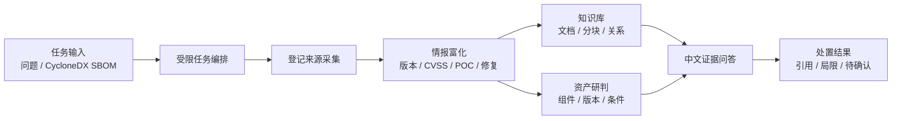

# AI 安全知识情报工作台

面向 AI 推理框架、模型供应链和 AI 应用风险的本地安全情报系统。它把公开漏洞、论文、标准与资产清单汇聚为可追溯的证据，并输出资产影响和处置建议。

## 它解决什么问题

安全人员不用在多个网站之间反复查询“这个 AI 漏洞是否影响我的服务、应先处理什么”。系统将采集、富化、知识检索、资产研判和中文问答放进同一条任务链；每个结论都附来源，证据不足时直接标为待确认或拒答。



## 当前能力

- 从后端登记的公开来源增量采集 AI 安全情报，记录原始快照、来源状态与运行结果。
- 富化 CVSS、受影响版本、修复版本、POC/利用线索、漏洞关系和关联资料。
- 导入 CycloneDX 1.3-1.7 SBOM，并按版本、暴露面、业务关键性和触发条件给出资产影响结论。
- 保存标准、法规等网页全文；新采集的 arXiv 论文会下载官方 PDF、按页提取正文并按章节和字符区间分块。问答引用可定位到文档块和快照版本。
- 支持中文提问、多轮事件/资产/文档指代、条件覆盖和歧义澄清。
- 使用带白名单、预算、依赖、检查点和角色交接记录的受限任务 DAG；不执行任意命令或访问任意网址。

## 快速启动

```powershell
cd competition
python -m venv .venv
.\.venv\Scripts\Activate.ps1
pip install -r requirements.txt
python -m uvicorn app.api:app --host 127.0.0.1 --port 8000
```

打开 <http://127.0.0.1:8000/>。

首次演示可先导入 SBOM 仿真样例，再在工作台运行采集与资产研判；知识图谱和证据问答会使用本机已保存的数据。

## 可选模型配置

复制 `.env.example` 为 `.env`，按需配置兼容 OpenAI API 的云端模型。密钥不会写入数据库或 Git。

不开启模型时，系统仍可以使用本地规则、事件库和文档检索工作。模型只用于候选事件选择和已有结论的转述，不能新增事实。

## 数据与边界

- 数据库、原始快照、运行证据和 `.env` 默认不纳入 Git。
- 演示资产有 `is_demo=true` 标记，不代表生产资产。
- 未发现证据不等于不存在风险；版本或条件不足时，系统输出“待确认”。
- 当前运行证据尚未达到连续 7 天和发布到采集延迟 ≤6 小时的赛题目标，不能将其作为已验证能力宣传。
- 当前有全文检索与多轮上下文；论文 PDF 只有成功提取正文后才标记为全文。跨文档多跳推理、独立准确率/召回率评测和独立多 Agent 协作仍在完善中。

## 验证

```powershell
python -m pytest -q
node --check app\static\app.js
python tools\browser_check.py --base http://127.0.0.1:8000
```

## 项目结构

| 路径 | 用途 |
| --- | --- |
| `app/` | API、采集器、富化、RAG、资产研判、任务编排与前端 |
| `tests/` | 单元、接口、RAG、多轮上下文和界面回归测试 |
| `research/` | 核验案例与来源说明 |
| `evaluation/` | 本地评测样本 |
| `examples/` | 资产仿真输入样例 |
| `tools/` | 采集、SBOM 仿真和浏览器检查脚本 |

更多设计与演示说明见 [使用说明](docs/USER_GUIDE.md)、[产品故事](docs/PRODUCT_STORY.md) 和 [智能体升级计划](docs/AGENT_UPGRADE_PLAN.md)。
